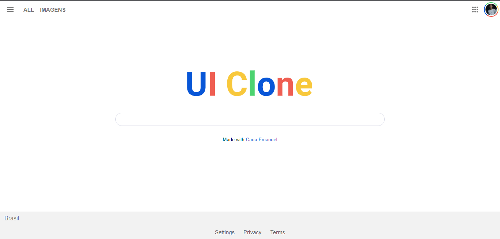

<h1 align="center">Google Clone</h1>

 
  

Este é um projeto de clone da página inicial do Google. Ele foi criado como parte de um exercício de aprendizado disponibilizado pela rocketseat para aprimorar minhas habilidades em desenvolvimento web.

 

<h1>Tecnologias utilizadas</h1>
<li>HTML</li>
<li>CSS</li>

 

<h1>Autor</h1>

Cauã Emanuel - <a href="https://github.com/cauaemanuel">GitHub</a>
 

<h1>Creditos</h1>

<a href="https://www.youtube.com/watch?v=KgjzE1Sxtq0">Aqui está o link do projeto na rocketseat

